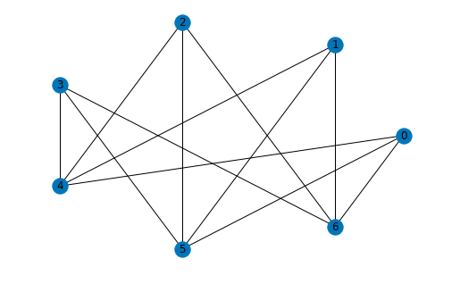
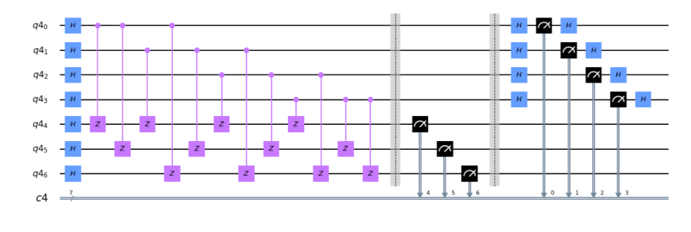

# Graph State Quantum Cryptography
A Jupyter notebook on the quantum cryptography application of blind quantum computation using graph states

[Become a Sponsor of The Singularity](https://github.com/sponsors/The-Singularity-Research)

---

## Graph States

Graph states are a special kind of quantum state prepared by a quantum circuit that is based on a graph, with nodes connected by vertices, as seen below:

Here is an example of a graph state quantum circuit:

## Graph State Quantum Cryptography

Using graph states, a protocol for transmitting quantum computations via the cloud to a potentially unsafe server for computation on remote quantum hardware can be developed using *blind quantum computing*. Check out the notebook for details. 

## The Notebook

[Graph State Quantum Cryptography Interactive Jupyter Notebook](https://mybinder.org/v2/gh/The-Singularity-Research/graph-state-quantum-cryptography/master?filepath=certifying_graph_states.ipynb
)

---

## Interested in contributing to this project? 
- Reach out via email to: thesingularity.research@gmail.com
- Be sure to include "Hacking the Universe" in the subject line, so that the email doesn't get overlooked. 
- Write a paragraph or two about how you would like to contribute.
- Ask to Join the Discord server. 
- Ask to Join the Slack Channel.

This is course material for a course on linear algebra and mathematical prerequisites for quantum computing. It contains Jupyter notebooks that can be downloaded as part of the course or opened in Binder as an online interactive notebook. 

[Become a Sponsor of The Singularity](https://github.com/sponsors/The-Singularity-Research)
